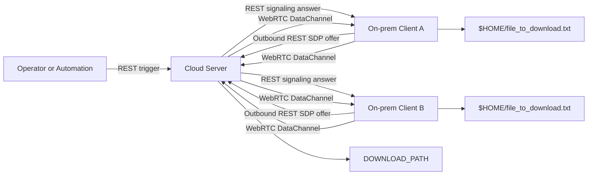
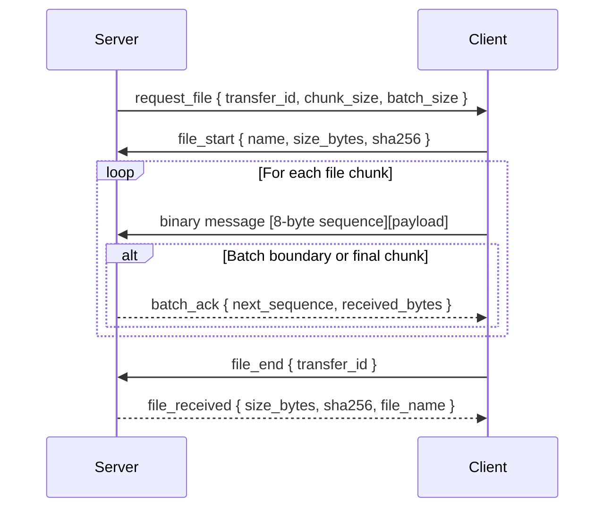

# WebRTC File Downloader

This project demonstrates a cloud-hosted signaling/download server that can request a file from one or more on-premise clients that sit behind private networks, such as clients deployed in restaurants.

Each client keeps a local file, by default:

```text
$HOME/file_to_download.txt
```

The server can trigger a download from any currently connected client by calling the REST API for that client's session.

## Approach

The system uses two channels:

- REST for signaling and control.
- WebRTC DataChannel for the actual file transfer.

Architecture overview:



The on-premise client starts first and makes an outbound REST request to the server with a WebRTC SDP offer. This works from private networks because the client initiates the public connection. The server responds with an SDP answer and both sides establish a WebRTC peer connection. Once the DataChannel is open, the server can request the file over that existing channel.

When the server triggers a download, it sends a `request_file` control message to the client. The client reads the configured local file, sends a `file_start` message with metadata, streams binary chunks over the DataChannel, waits for server batch acknowledgements, then sends `file_end`. The server writes the file to a temporary `.part` file, verifies size and SHA-256, then renames it into the configured download directory.

DataChannel transfer detail:



## Why This Design

On-premise clients are usually behind NAT, firewalls, or private LANs, so exposing each client directly to the public internet is brittle and risky. This design avoids inbound connectivity to the client entirely. Clients only need outbound access to the cloud server.

WebRTC DataChannel is a good fit because it supports reliable binary transfer, NAT traversal through ICE/STUN, and long-lived peer sessions. REST remains useful for simple operational actions: session creation, health checks, session inspection, and triggering a download.

The transfer protocol is intentionally conservative:

- Files are chunked into DataChannel-safe message sizes.
- The server sends batch acknowledgements.
- The client waits for acknowledgements to avoid overwhelming the channel.
- The server validates declared size and SHA-256 before committing the file.
- Completed files are written under the server download directory.

## Configuration

Copy the example env file:

```bash
cp .env.example .env
```

Server variables:

```env
SERVER_HOST=localhost
SERVER_PORT=8080
DOWNLOAD_PATH=./tmp/downloads
CORS_ALLOW_ORIGIN=*
STUN_URLS=stun:stun.l.google.com:19302
```

Client variables:

```env
SIGNALING_URL=http://localhost:8080
CLIENT_ID=
LOCAL_FILE_PATH=
LOCAL_FILE_NAME=file_to_download.txt
STUN_URLS=stun:stun.l.google.com:19302
```

If `CLIENT_ID` is empty, the client uses the machine hostname. If `LOCAL_FILE_PATH` is empty, the client uses the user's home directory.

## Run The Server

Install dependencies:

```bash
go mod download
```

Start the server:

```bash
go run server/main.go
```

Health check:

```bash
curl http://localhost:8080/healthz
```

Downloaded files are written to `DOWNLOAD_PATH`.

## Run A Client

Start a client:

```bash
go run client/main.go
```

For local testing, create the configured file at startup if it does not exist:

```bash
go run client/main.go --create-file
```

This creates a 100 MB text file containing repeated `a-z0-9` characters at:

```text
LOCAL_FILE_PATH/LOCAL_FILE_NAME
```

When the client connects successfully, the client logs the `session_id`. Use that session ID to trigger downloads.

## Trigger A Download

The trigger API does not require a JSON body. The target client is selected by `session_id` in the URL.

Request:

```http
POST /api/v1/webrtc/sessions/{session_id}/files/request HTTP/1.1
Host: localhost:8080
Content-Type: application/json

{}
```

Curl example:

```bash
curl -X POST "http://localhost:8080/api/v1/webrtc/sessions/{session_id}/files/request" \
  -H "Content-Type: application/json" \
  -d "{}"
```

Successful response:

```json
{
  "session_id": "replace-with-session-id",
  "transfer_id": "replace-with-transfer-id",
  "status": "requested"
}
```

The server logs completion with file name, size, SHA-256, and transfer duration. The client also logs completion after the server verifies the received file.

## Inspect Or Delete A Session

Get session state:

```bash
curl http://localhost:8080/api/v1/webrtc/sessions/{session_id}
```

Delete a session:

```bash
curl -X DELETE http://localhost:8080/api/v1/webrtc/sessions/{session_id}
```

## Operational Notes

Run one client process per on-premise location. Give each client a stable `CLIENT_ID`, such as a restaurant ID, if operators need to map sessions to physical sites.

The current server stores sessions in memory. Restarting the server drops active sessions, and clients reconnect automatically. The current implementation exposes a trigger endpoint by session ID; production deployments would usually add authentication, authorization, TLS termination, persistent client registration, and a session listing API.
